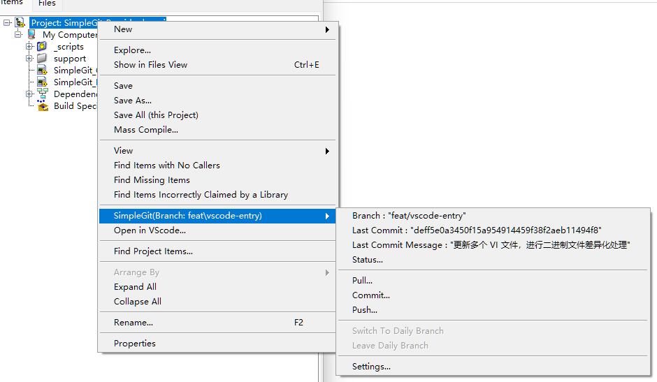

# SimpleGit-Provider

1. Simple git provider for LVAPT daily workflow. Windows of Tortoisegit will be used if it's installed.
2. Provide an entry for "Open in VSCode" in the context menu of the project explorer.

## Dependence

- Git API
- [Tortoisegit](https://tortoisegit.org/)
- [Automating TortoiseGit](https://tortoisegit.org/docs/tortoisegit/tgit-automation.html#tgit-automation-basics)
